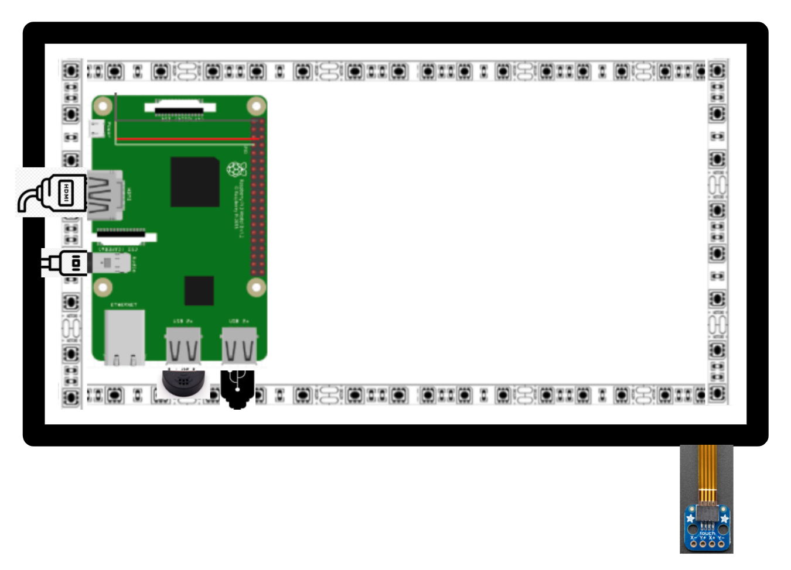

# Smart Mirror
My project is a Smart Mirror powered by raspberry pi. It has Spotify, camera, weather, and clock APIs. 

| **Engineer** | **School** | **Area of Interest** | **Grade** |
|:--:|:--:|:--:|:--:|
| Anaaya M | Dougherty Valley High School | Electrical Engineering | Incoming Sophmore |

# Demo:

<iframe width="560" height="315" src="https://www.youtube.com/embed/OvOiLL-O-Ss" title="YouTube video player" frameborder="0" allow="accelerometer; autoplay; clipboard-write; encrypted-media; gyroscope; picture-in-picture" allowfullscreen></iframe>

# Final Milestone
My final milestone was finalizing the composition of the mirror. I made the spotify API smaller so that it wouldn’t cover up the time module while music was playing. I did this by changing the type of player from the default to a mini version of it through the configuration file. Additionally, I changed the time module from a 24-hour clock to a 12-hour so that it’s easier to read. I also attached a microphone so that Spotify could play through there instead of an outside speaker. Although my Alexa module didn't work, it is still able to detect the wakeword through MMM-Detector.

[![Final Milestone]
<iframe width="560" height="315" src="https://www.youtube.com/embed/jwqC-7OpOLs" title="YouTube video player" frameborder="0" allow="accelerometer; autoplay; clipboard-write; encrypted-media; gyroscope; picture-in-picture" allowfullscreen></iframe>

<small>This is some of the code from my Spotify Configuration file where I was able to adjust the size of the API and what type of display I wanted. I set the style to mini so it would fit better within the mirror and not obstruct the time module.</small>

# Second Milestone
My second milestone is being able to take pictures and adding a two way mirror. To add the camera feature, I downloaded the module from a github website and added it to my SmartMirror folder. After that, I had to install the camera by inserting it into the camera slot, which is between Ethernet and HDMI Port. To test it out, I used the command raspistill -o cam.jpg and that displayed what my camera was pointed at onto the screen. For the two way mirror, I used a box cutter to score it after measuring the dimensions and marking it. Then, I was able to break it by folding the mirror on the mark. I used double sided tape to secure it to the monitor, so the mirror would still be removable.

<iframe width="560" height="315" src="https://www.youtube.com/embed/YkLiQdUwaio" title="YouTube video player" frameborder="0" allow="accelerometer; autoplay; clipboard-write; encrypted-media; gyroscope; picture-in-picture" allowfullscreen></iframe>

<small>This is an example of the default configurations for spotify and alarms. Since I wrote in the position as "Bottom_left" it'll display in that corner and adjust according to the display size. For the alert API, there isn't any options to adjust it because the module doesn't display on the screen but will still be on in the background.</small>

# First Milestone
My first milestone was setting up the raspberry pi. To do this, I used an SD card to download the raspbian software from the website and then connect the card to the raspberry pi. Then, I downloaded all the basic code for the Magic Mirror from the github website. I deleted any features that I didn’t want on the mirror, including the calendar and US holiday modules, from the configuration file. Additionally, I added touchscreen and camera capabilities by adding the downloaded code to the modules folder. After that, I adjusted the compositions of the icons on the magic mirror through the configuration file by editing the position and then sizing so everything fit. 

<iframe width="560" height="315" src="https://www.youtube.com/embed/-aOUHmi5NIQ" title="YouTube video player" frameborder="0" allow="accelerometer; autoplay; clipboard-write; encrypted-media; gyroscope; picture-in-picture" allowfullscreen></iframe>
